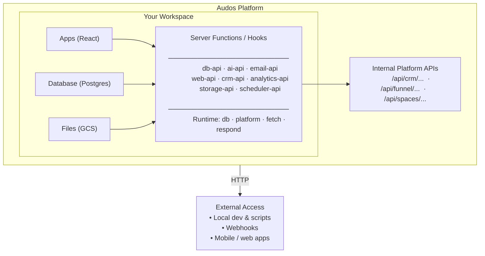

# Audos Platform Overview

*Last Updated: March 31, 2026*

---

## What is Audos?

Audos is a **no-code/low-code platform** for building businesses with AI assistance. It provides:

- **Workspaces** - Isolated environments for each business
- **Apps** - React-based mini-applications
- **Landing Pages** - Custom websites
- **Database** - Workspace-scoped PostgreSQL
- **Server Functions** - Custom backend logic
- **Otto** - AI assistant that helps build and manage

---

## Architecture Diagram



---

## Key Concepts

### 1. Workspace Isolation

Each workspace is completely isolated:
- Own database tables (schema prefix)
- Own file storage bucket
- Own server functions
- Own domain/subdomain

### 2. Server Functions (Hooks)

Server functions are the **extensibility layer**:
- Pure JavaScript (not Node.js, no require)
- Access to `db`, `platform`, `fetch`
- HTTP-callable from anywhere
- Workspace-scoped (automatically filtered)

### 3. Primitives vs Composites

| Primitives (Built-in) | Composites (You Build) |
|-----------------------|-----------------------|
| `db.query()` | `guest-research-api` |
| `platform.generateText()` | `transcript-api` |
| `fetch()` | `social-clips-api` |
| `platform.sendEmail()` | `digest-api` |

Primitives are the building blocks; composites combine them for specific use cases.

### 4. HTTP API Pattern

All server functions are accessed via:

```
/api/hooks/execute/workspace-{NUMBER}/{HOOK-NAME�LE}
```

Example for Throughline:
```
POST /api/hooks/execute/workspace-351699/db-api
```

---

## What Audos Provides vs What You Build

| Layer | Provided by Audos | You Build/Customize |
|-------|-------------------|----------------------|
| **Infrastructure** | Hosting, CDN, SSL, Domains | Custom domain config |
| **Database** | PostgreSQL, backups, isolation | Table schemas, queries |
| **AI** | GPT-4o-mini access | Prompts, workflows |
| **Email** | Transactional email service | Templates, triggers |
| **Storage** | GCS bucket | File organization |
| **Apps** | React runtime, components | App logic, UI |
| **Server Functions** | Runtime, HTTP handling | Business logic |
| **CRM** | Contact storage, tracking | Segmentation, workflows |
| **Analytics** | Event tracking, funnel | Custom dashboards |
| **Ads** | Meta integration | Campaign config |

---

## The Mental Model

Think of Audos as:

1. **A managed backend** - Database, storage, AI, email all provisioned
2. **An app runtime** - React apps with built-in hooks for data
3. **An extensible API layer** - Server functions let you expose anything
4. **An AI assistant** - Otto helps build and manage

You can use it as:
- **No-code**: Let Otto build everything
- **Low-code**: Guide Otto, customize via APIs
- **Hybrid**: Build locally, use Audos as backend

---

## Limitations to Know

1. **No direct file editing** - Can't edit React code directly, must use Otto
2. **No Node.js** - Server functions are vanilla JS (no require, no npm)
3. **No headless browser** - Can't render JS-based pages in fetch
4. **Execution timeout** - Server functions timeout after ~30s
5. **Runtime gaps** - No `URLSearchParams`, no `Buffer`, limited `Response`

---

## Getting Started

1. **For new workspaces**: Talk to Otto, describe your business
2. **For API access**: Ask Otto to create server functions (see templates)
3. **For app changes**: Describe what you want, Otto builds it
4. **For database**: Ask Otto to create tables, use db-api to access